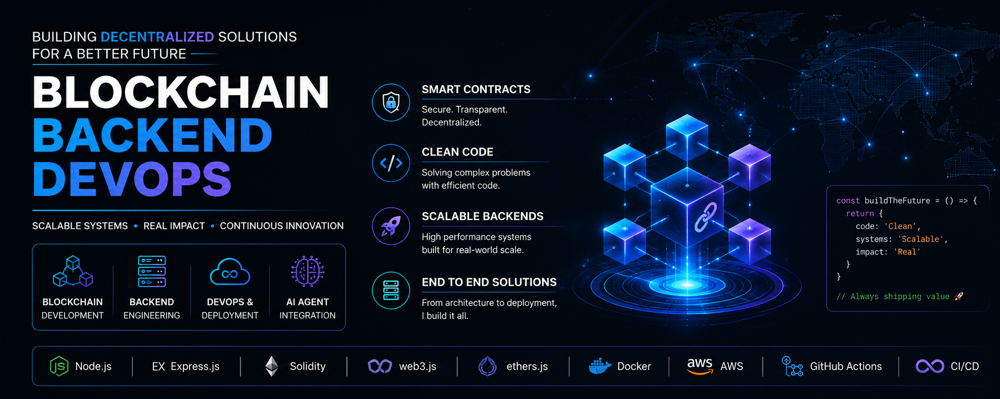

 

# Shivam Singh &nbsp;·&nbsp; `dalton150`

**Backend & Blockchain Engineer &nbsp;|&nbsp; DevOps &nbsp;|&nbsp; AI Systems**

*3+ years building production-grade backend, blockchain, DevOps, and AI systems for scalable Web2 & Web3 applications.*

 

&nbsp;

&nbsp;

 

&nbsp;&nbsp;

---

## Proof of Work

| | |
|:---:|:---|
| **3+ Years** | Production engineering across Web2, Web3, and AI systems |
| **100+** | Trading pairs on a live Multi-Chain DEX |
| **70+** | Smart contracts deployed across EVM-compatible networks |
| **50+** | Complex reward and referral distribution systems |
| **Full-Stack** | Cloud infrastructure, CI/CD pipelines, and end-to-end production deployments |

---

## Engineering Pillars

<table>
<tr>
<td align="center" width="25%">

**Backend Systems**

Node.js · Express.js
REST APIs · WebSockets
Distributed Systems
Real-Time Applications

</td>
<td align="center" width="25%">

**Blockchain Infrastructure**

Solidity · Ethers.js · Web3.js
Hardhat · Foundry · DeFi
Smart Contracts · DEX
Wallets · Token Systems

</td>
<td align="center" width="25%">

**DevOps & Cloud**

Docker · AWS · Linux
Nginx · CI/CD Pipelines
Production Deployments
Infrastructure Management

</td>
<td align="center" width="25%">

**AI Systems**

RAG Pipelines · Vector DBs
OpenAI APIs · LangChain
Agentic AI · Prompt Engineering
Multi-Agent Orchestration

</td>
</tr>
</table>

---

## Featured Work

### Multi-Chain DEX

| | |
|:--|:--|
| **Problem** | Build a production decentralized exchange with cross-chain liquidity across multiple blockchain networks |
| **Built** | Multi-chain DEX with 100+ trading pairs, LP management, and real-time execution |
| **Stack** | `Node.js` · `Solidity` · `Ethers.js` · `WebSockets` · `MongoDB` |
| **Impact** | 100+ trading pairs live across EVM-compatible chains |

Cross-chain token swaps with on-chain LP settlement, WebSocket price feeds, and smart contract-driven automated trade execution.

---

### Binary Trading Platform

| | |
|:--|:--|
| **Problem** | Automate blockchain-based trading with secure wallet infrastructure and reward distribution |
| **Built** | HD Wallet platform with multi-level reward contracts and real-time trade processing |
| **Stack** | `Node.js` · `Solidity` · `Hardhat` · `PostgreSQL` · `Docker` · `AWS` |
| **Impact** | Production multi-chain platform with fully automated deposit tracking |

HD Wallet derivation with on-chain deposit detection, smart contract referral trees, and WebSocket-driven order management.

---

### Token & Presale Ecosystem

| | |
|:--|:--|
| **Problem** | Build complete blockchain infrastructure for a token from creation through distribution |
| **Built** | Full token lifecycle with staking, vesting, presale, and mining contracts |
| **Stack** | `Solidity` · `Hardhat` · `Ethers.js` · `Node.js` · `MongoDB` |
| **Impact** | 50+ reward distribution systems across multiple tokenomics models |

ERC20 token development, on-chain vesting schedules, presale infrastructure, and mining contract primitives.

---

### AI Chat Backend (RAG System)

| | |
|:--|:--|
| **Problem** | Build a context-aware AI backend that retrieves accurate answers from large document sets |
| **Built** | RAG backend with vector search, embedding pipelines, and LLM agent integration |
| **Stack** | `Python` · `Node.js` · `OpenAI API` · `LangChain` · `Vector DB` |
| **Impact** | Production AI agent with semantic retrieval and multi-step reasoning |

Document chunking pipelines, embedding generation, vector similarity search, and context-grounded response generation.

---

## Tech Stack

**Backend**

**Blockchain**

**Databases**

**DevOps & Cloud**

**AI & Machine Learning**

---

## GitHub Activity

 

---

## Currently Building

- Agentic AI architectures and multi-agent orchestration frameworks
- Advanced RAG pipelines with hybrid search, re-ranking, and memory layers

---

## Connect

📍 Gurugram, India

 

&nbsp;

&nbsp;

---

*"Great systems are built through simplicity, reliability, and continuous improvement."*

