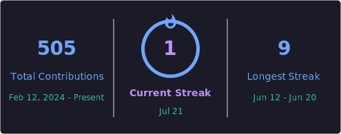

 

# Shivam Singh &nbsp;·&nbsp; `dalton150`

**Backend & Blockchain Engineer &nbsp;|&nbsp; DevOps &nbsp;|&nbsp; AI Systems**

*I build production-grade backend, blockchain, DevOps, and AI systems for scalable Web2 & Web3 applications.*

 

&nbsp;

&nbsp;

 

---

## Proof of Work

| | |
|:---:|:---|
| **3+ Years** | Production engineering across Web2, Web3, and backend systems |
| **100+** | Trading pairs on a live Multi-Chain DEX |
| **70+** | Smart contracts deployed across EVM-compatible networks |
| **50+** | Complex reward and referral distribution systems |
| **Full-Stack** | Cloud infrastructure, CI/CD pipelines, and end-to-end production deployments |

---

## Work Tracks

<table>
<tr>
<td valign="top" width="25%">

### Backend
**Production**

- Node.js · Express.js · JavaScript
- MongoDB · PostgreSQL · Redis
- REST APIs · WebSockets
- Real-time & distributed systems

</td>
<td valign="top" width="25%">

### Blockchain
**Production**

- Solidity · Smart Contracts
- Ethers.js · Web3.js · Web3 APIs
- EVM chains · Real-time txs
- Hardhat · Foundry · IPFS
- ERC20 · ERC721 · ERC1155
- ERC4626 · ERC2612 · EIPs

</td>
<td valign="top" width="25%">

### DevOps & Cloud
**Production**

- Linux · Docker · Kubernetes
- GitHub Actions · Jenkins
- CI/CD pipelines
- AWS · Nginx · Deployments

</td>
<td valign="top" width="25%">

### AI & Agentic
**Learning / Exploring**

- AI agent integration
- RAG · ChromaDB
- OpenAI APIs
- Open-source models & frameworks
- Progress: tool calling done
- Next: full agent workflows

</td>
</tr>
</table>

---

## Featured Systems

### Multi-Chain DEX

| | |
|:--|:--|
| **Problem** | Build a production decentralized exchange with cross-chain liquidity across multiple blockchain networks |
| **Built** | Multi-chain DEX with 100+ trading pairs, LP management, and real-time execution |
| **Stack** | `Node.js` · `Solidity` · `Ethers.js` · `WebSockets` · `MongoDB` · `Redis` |
| **Impact** | 100+ trading pairs live across EVM-compatible chains |

Cross-chain token swaps with on-chain LP settlement, WebSocket price feeds, and smart contract-driven automated trade execution.

---

### Binary Trading Platform

| | |
|:--|:--|
| **Problem** | Automate blockchain-based trading with secure wallet infrastructure and reward distribution |
| **Built** | HD Wallet platform with multi-level reward contracts and real-time trade processing |
| **Stack** | `Node.js` · `Solidity` · `Hardhat` · `PostgreSQL` · `Redis` · `Docker` · `AWS` |
| **Impact** | Production multi-chain platform with fully automated deposit tracking |

HD Wallet derivation with on-chain deposit detection, smart contract referral trees, and WebSocket-driven order management.

---

### Token & Presale Ecosystem

| | |
|:--|:--|
| **Problem** | Build complete blockchain infrastructure for a token from creation through distribution |
| **Built** | Full token lifecycle with staking, vesting, presale, and mining contracts |
| **Stack** | `Solidity` · `Hardhat` · `Foundry` · `Ethers.js` · `Node.js` · `MongoDB` · `IPFS` |
| **Impact** | 50+ reward distribution systems across multiple tokenomics models |

ERC20 / vesting / staking / presale infrastructure with EIP-aware contract patterns across EVM-compatible networks.

---

### AI Chat Backend (RAG)

| | |
|:--|:--|
| **Problem** | Build a context-aware AI backend that retrieves accurate answers from large document sets |
| **Built** | Applied RAG backend with vector search, embedding pipelines, and LLM integration |
| **Stack** | `Node.js` · `OpenAI API` · `ChromaDB` · `RAG` |
| **Impact** | Working RAG retrieval pipeline with context-grounded responses |

Document chunking, embedding generation, vector similarity search, and grounded response generation.  
**Note:** Full Agentic AI (multi-agent orchestration beyond tool calling) is tracked separately under Learning.

---

## Tech Stack Map

**Backend**

**Databases & Cache**

**Blockchain**

**EVM Standards**

**DevOps & Cloud**

**AI & Agentic (Learning)**

---

## GitHub Stats

 

 

---

## Currently Exploring

- **Agentic AI** — tool calling completed; building toward multi-agent orchestration and full agent workflows
- Advanced RAG — hybrid search, re-ranking, memory layers, and ChromaDB pipelines
- Open-source models and frameworks for agent integration

---

## Connect

📍 Gurugram, India

 

&nbsp;

&nbsp;

---

*"Great systems are built through simplicity, reliability, and continuous improvement."*

